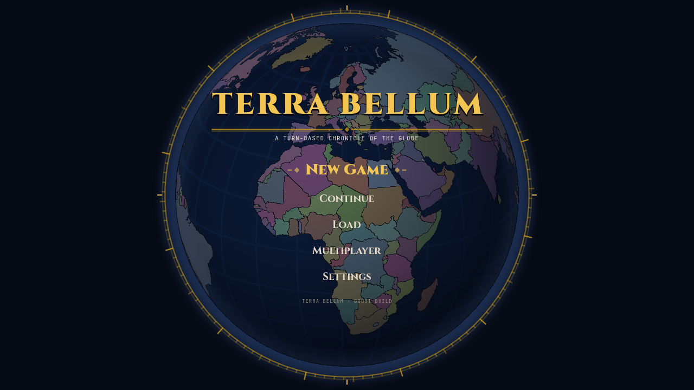
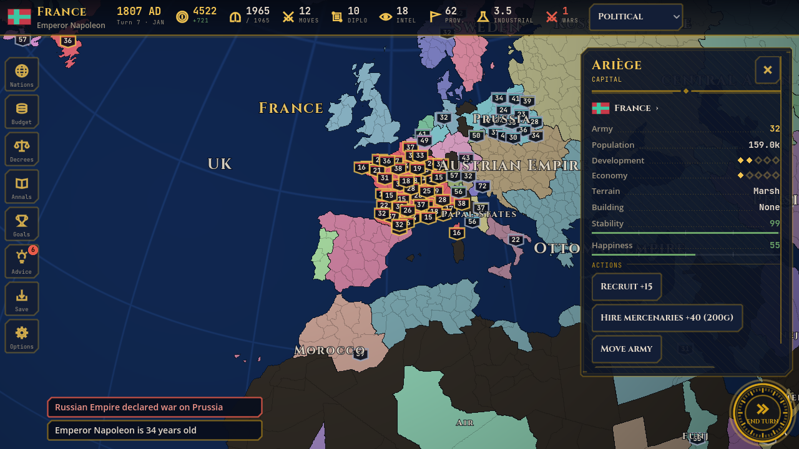

# Terra Bellum

Turn-based grand strategy on a globe — **rebuilt natively in Godot 4** (GDScript) for Android, Windows and iOS.
The original browser game is kept untouched in `index.html` until the rebuild reaches full feature parity.

## What is in the game
Province-level grand strategy on a GPU-rendered globe/flat map, 13 start eras (218 BC – today), ~250 nations.
Economy, tech and eras, buildings, armies and combat, peace deals (white / land / vassal), alliances and pacts,
**named rulers** with traits and succession (≈140 historical rulers), **casus belli, infamy and coalitions**,
**national decrees**, **trade deals**, espionage, rebels, ~255 dated historical events with choices, random events,
five victory paths, a chronicle, an advisor, statistics charts. EN/RU, authoritative multiplayer, synthesised sound.
UI: "war table" design system (see `docs/ARCHITECTURE.md`).

 

## Layout
| Path | What |
|---|---|
| `godot/` | The game (Godot 4.4.1, Compatibility/GLES3 renderer) |
| `godot/src/engine/` | Pure simulation (typed arrays, deterministic, no Nodes) |
| `godot/src/render/` | GPU map: one fragment shader (globe/flat, borders, lenses) + overlay |
| `godot/src/ui/` | Screens, HUD, panels, modals, multiplayer UI |
| `godot/src/net/` | Authoritative multiplayer: shared `TBNet` node, rooms, delta protocol, dedicated server |
| `godot/tests/` | Headless tests, screenshot/perf/multiplayer harnesses |
| `reference/engine-js/` | JS reference engine — oracle the GDScript engine is verified against (bit-exact) |
| `tools/` | `bake.mjs` (map → compact data), `oracle.sh`, `i18n.mjs` |
| `docs/` | `REBUILD_PLAN.md`, `ARCHITECTURE.md` |

## Run / test
```bash
# Godot 4.4.1 required (https://godotengine.org)
godot --path godot                                   # run the game
godot --headless --path godot -s tests/run_all.gd    # engine tests
npm ci && tools/oracle.sh                            # GDScript engine == JS reference (bit-exact checksums)
# GPU rendering without a display (software GL):
xvfb-run -a godot --path godot --rendering-driver opengl3 -s tests/playthrough.gd -- /tmp/shots
```

## Rebuild data (only when maps change)
`npm ci && npm run bake && node tools/i18n.mjs` → writes `godot/data/` (≈ 350 KB total vs 3.9 MB of legacy map data).

## Multiplayer
Dedicated authoritative server running the same engine; clients send commands and receive compact deltas.
```bash
godot --headless --path godot res://src/net/server.tscn -- --port 8080     # local server
```
Deployed on Render as `terra-bellum-godot-server` (Docker, `server/Dockerfile`, WebSocket on `$PORT`); default URL `wss://terra-bellum-godot-server.onrender.com`. The legacy web-game server (`terra-bellum-server`) is untouched.

## Export
Presets for Windows, Linux, Android, iOS are in `godot/export_presets.cfg`; `.github/workflows/godot.yml` builds them in CI.
